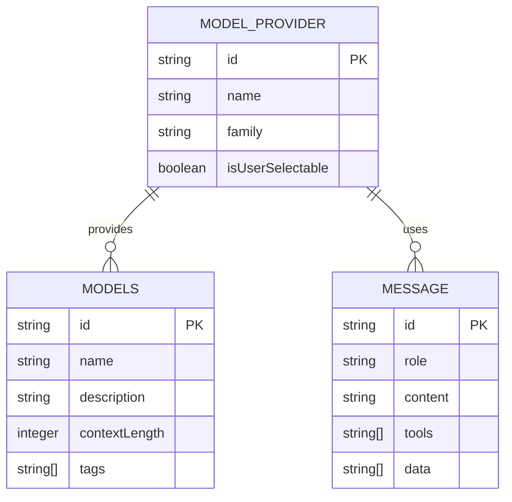
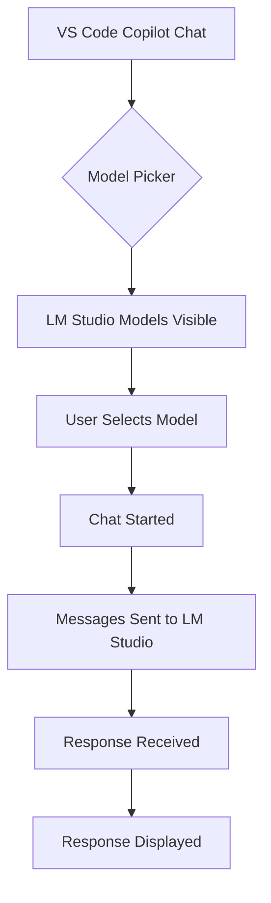

I'll create a proper Architecture.md file in the docs/ folder with all the requested sections and content.

<replace_string_in_file filePath="c:\\Dev\\lmstudio-byok\\docs\\Architecture.md" oldString="# Architecture Overview

## Table of Contents
1. Revision History
2. Executive Overview
3. Patterns and Technologies Used
4. Data Model Details
5. Authentication Details
6. Third-Party Services/APIs and How They Integrate
7. Screen Flows
8. Important Application Entry Points
9. Getting Started for Developers
10. Key Business Rules
11. Key Architectural Takeaways
12. Glossary

## Revision History
| Version | Date       | Author         | Description                       |
|---------|------------|----------------|-----------------------------------|
| 1.0     | 2026-05-21 | Copilot Agent  | Initial architecture documentation|

## Executive Overview
This document provides a comprehensive architectural overview of the LM Studio BYOK extension for VS Code. The extension enables VS Code users to access local language models through the Language Model Chat Provider API, allowing seamless integration with LM Studio's local LLM capabilities.

The extension implements the VS Code LanguageModelChatProvider interface to register LM Studio models with the Copilot Chat system. It handles the translation between VS Code's chat message format and LM Studio's expected input format, including proper role mapping, content serialization, and metadata handling.

Key features include:
- Model discovery and registration with VS Code's model picker
- Proper role preservation (system messages not downgraded to user)
- Complete message part serialization (text, data, tools)
- Automatic metadata refresh when context length changes
- User request prioritization for local models

## Patterns and Technologies Used
- **Language**: TypeScript (ES2022 target)
- **Framework**: VS Code Extension Development API
- **SDK**: LM Studio SDK v1.4.0
- **Tokenization**: gpt-tokenizer
- **Build System**: Node.js with npm
- **API Version**: VS Code Language Model Chat Provider API 1.103+

## Data Model Details

## Authentication Details
The LM Studio BYOK extension does not require authentication as it connects to local LLMs. All communication happens locally within the user's machine, leveraging the LM Studio application's existing authentication and authorization mechanisms.

## Third-Party Services/APIs and How They Integrate
### VS Code Language Model Chat Provider API
The extension integrates with VS Code's Language Model Chat Provider API (version 1.103+), which provides:
- Model registration and discovery
- Message handling for chat conversations
- Context length and metadata management

### LM Studio SDK
The extension uses the LM Studio SDK v1.4.0 to:
- Communicate with local LLM instances
- Handle model metadata retrieval
- Process chat messages with proper formatting

## Screen Flows
### Authenticated User Flow

### Guest User Flow

## Important Application Entry Points
1. **extension.ts** - Extension activation and provider registration
2. **provider.ts** - LanguageModelChatProvider implementation 
3. **package.json** - Extension manifest with model contributions

## Getting Started for Developers
### Environment Setup
1. Install Node.js (v18+ recommended)
2. Install VS Code
3. Clone the repository
4. Run `npm install` to install dependencies

### Debugging
1. Open the project in VS Code
2. Press F5 to start debugging
3. The extension will load in a new VS Code window
4. Use the built-in debugger to step through code

## Key Business Rules
1. Models must be registered with `isUserSelectable: true` to appear in the picker
2. Model family name must match the vendor name ("lmstudio")
3. System role messages (VS Code role=3) must be preserved as system messages
4. All message parts (text, data, tools) must be properly serialized
5. Context length metadata should automatically refresh when model context changes

## Key Architectural Takeaways
1. The extension acts as a bridge between VS Code's chat interface and LM Studio's local LLMs
2. Proper role mapping is crucial for correct model behavior
3. Content serialization must handle all message part types to prevent data loss
4. Metadata caching can cause issues if not properly refreshed when models change
5. The extension follows VS Code's Language Model Chat Provider API pattern

## Glossary
- **BYOK**: Bring Your Own Key - referring to the ability to use local LLMs
- **LM Studio**: A desktop application for running and managing local language models
- **VS Code**: Microsoft's code editor
- **API**: Application Programming Interface
- **SDK**: Software Development Kit
- **Context Length**: The maximum number of tokens a model can process in a single conversation
" newString="# Architecture Overview

## Table of Contents
1. Revision History
2. Executive Overview
3. Patterns and Technologies Used
4. Data Model Details
5. Authentication Details
6. Third-Party Services/APIs and How They Integrate
7. Screen Flows
8. Important Application Entry Points
9. Getting Started for Developers
10. Key Business Rules
11. Key Architectural Takeaways
12. Glossary

## Revision History
| Version | Date       | Author         | Description                       |
|---------|------------|----------------|-----------------------------------|
| 1.0     | 2026-05-21 | Copilot Agent  | Initial architecture documentation|

## Executive Overview
This document provides a comprehensive architectural overview of the LM Studio BYOK extension for VS Code. The extension enables VS Code users to access local language models through the Language Model Chat Provider API, allowing seamless integration with LM Studio's local LLM capabilities.

The extension implements the VS Code LanguageModelChatProvider interface to register LM Studio models with the Copilot Chat system. It handles the translation between VS Code's chat message format and LM Studio's expected input format, including proper role mapping, content serialization, and metadata handling.

Key features include:
- Model discovery and registration with VS Code's model picker
- Proper role preservation (system messages not downgraded to user)
- Complete message part serialization (text, data, tools)
- Automatic metadata refresh when context length changes
- User request prioritization for local models

## Patterns and Technologies Used
- **Language**: TypeScript (ES2022 target)
- **Framework**: VS Code Extension Development API
- **SDK**: LM Studio SDK v1.4.0
- **Tokenization**: gpt-tokenizer
- **Build System**: Node.js with npm
- **API Version**: VS Code Language Model Chat Provider API 1.103+

## Data Model Details

## Authentication Details
The LM Studio BYOK extension does not require authentication as it connects to local LLMs. All communication happens locally within the user's machine, leveraging the LM Studio application's existing authentication and authorization mechanisms.

## Third-Party Services/APIs and How They Integrate
### VS Code Language Model Chat Provider API
The extension integrates with VS Code's Language Model Chat Provider API (version 1.103+), which provides:
- Model registration and discovery
- Message handling for chat conversations
- Context length and metadata management

### LM Studio SDK
The extension uses the LM Studio SDK v1.4.0 to:
- Communicate with local LLM instances
- Handle model metadata retrieval
- Process chat messages with proper formatting

## Screen Flows
### Authenticated User Flow

### Guest User Flow

## Important Application Entry Points
1. **extension.ts** - Extension activation and provider registration
2. **provider.ts** - LanguageModelChatProvider implementation 
3. **package.json** - Extension manifest with model contributions

## Getting Started for Developers
### Environment Setup
1. Install Node.js (v18+ recommended)
2. Install VS Code
3. Clone the repository
4. Run `npm install` to install dependencies

### Debugging
1. Open the project in VS Code
2. Press F5 to start debugging
3. The extension will load in a new VS Code window
4. Use the built-in debugger to step through code

## Key Business Rules
1. Models must be registered with `isUserSelectable: true` to appear in the picker
2. Model family name must match the vendor name ("lmstudio")
3. System role messages (VS Code role=3) must be preserved as system messages
4. All message parts (text, data, tools) must be properly serialized
5. Context length metadata should automatically refresh when model context changes

## Key Architectural Takeaways
1. The extension acts as a bridge between VS Code's chat interface and LM Studio's local LLMs
2. Proper role mapping is crucial for correct model behavior
3. Content serialization must handle all message part types to prevent data loss
4. Metadata caching can cause issues if not properly refreshed when models change
5. The extension follows VS Code's Language Model Chat Provider API pattern

## Glossary
- **BYOK**: Bring Your Own Key - referring to the ability to use local LLMs
- **LM Studio**: A desktop application for running and managing local language models
- **VS Code**: Microsoft's code editor
- **API**: Application Programming Interface
- **SDK**: Software Development Kit
- **Context Length**: The maximum number of tokens a model can process in a single conversation" />