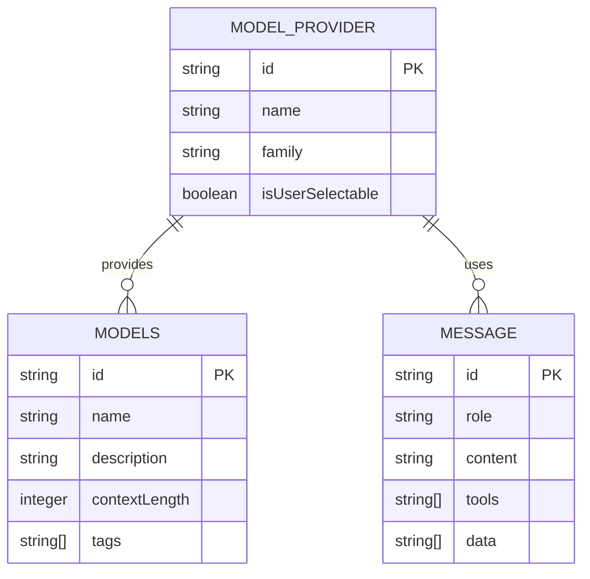
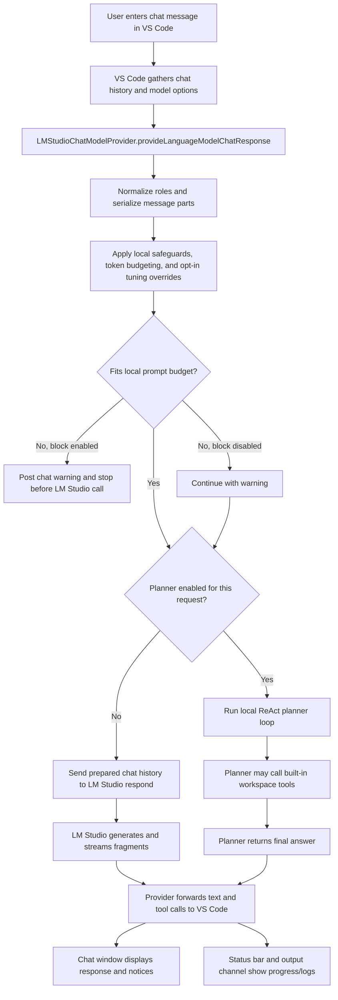
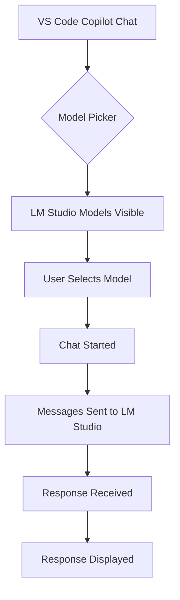
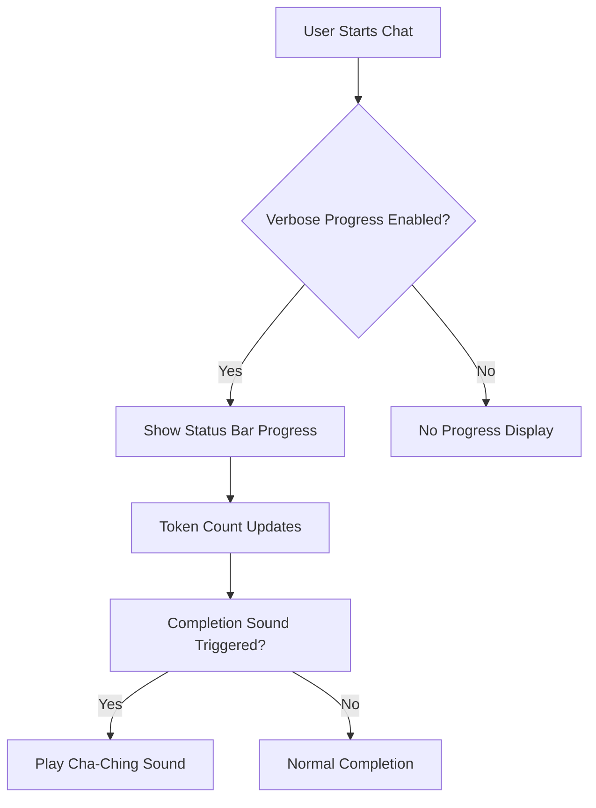

# Architecture Overview

## Table of Contents

1. Revision History
2. Executive Overview
3. Patterns and Technologies Used
4. Data Model Details
5. Authentication Details
6. Third-Party Services/APIs and How They Integrate
7. Chat Client Flow
8. Screen Flows
9. Important Application Entry Points
10. Getting Started for Developers
11. Key Business Rules
12. Key Architectural Takeaways
13. Glossary

## Revision History

- 1.0 | 2026-05-21 | Copilot Agent | Initial architecture documentation
- 1.1 | 2026-05-22 | Copilot Agent | Added configuration and progress reporting details
- 1.2 | 2026-05-23 | Copilot Agent | Added context overflow handling and documentation updates
- 1.3 | 2026-05-23 | Copilot Agent | Added planner mode, model tuning overrides, and review notes
- 1.4 | 2026-05-23 | Copilot Agent | Added smoke-test validation notes and planner parse-retry guidance
- 1.5 | 2026-05-24 | Copilot Agent | Clarified planner-mode user experience, status indicators, and documentation scope/limits
- 1.6 | 2026-05-24 | Copilot Agent | Distinguished platform-backed planner behavior from extension-defined heuristic recovery
- 1.7 | 2026-05-24 | Copilot Agent | Added per-request /plan and /noplan overrides and documented routing precedence

## Executive Overview

This document provides a comprehensive architectural overview of the LM Studio BYOK extension for VS Code. The extension enables VS Code users to access local language models through the Language Model Chat Provider API, allowing seamless integration with LM Studio's local LLM capabilities.

The extension implements the VS Code LanguageModelChatProvider interface to register LM Studio models with the Copilot Chat system. It handles the translation between VS Code's chat message format and LM Studio's expected input format, including proper role mapping, content serialization, and metadata handling.

Key features include:

- Model discovery and registration with VS Code's model picker
- Proper role preservation (system messages not downgraded to user)
- Complete message part serialization (text, data, tools)
- Automatic metadata refresh when context length changes
- User request prioritization for local models
- Verbose progress reporting in status bar and output channel
- Configurable token threshold sound notifications
- Performance optimization features
- Optional ReAct-style planner mode
- Optional global model tuning overrides with per-setting enable flags
- Heuristic image-input capability detection for common vision-model identifiers

## Patterns and Technologies Used

- **Language**: TypeScript (ES2022 target)
- **Framework**: VS Code Extension Development API
- **SDK**: LM Studio SDK v1.4.0
- **Tokenization**: gpt-tokenizer
- **Build System**: Node.js with npm
- **API Version**: VS Code Language Model Chat Provider API 1.103+
- **Audio**: WAV file for sound notifications (Windows-specific)

## Data Model Details

## Authentication Details

The LM Studio BYOK extension does not require authentication as it connects to local LLMs. All communication happens locally within the user's machine, leveraging the LM Studio application's existing authentication and authorization mechanisms.

## Third-Party Services/APIs and How They Integrate

### VS Code Language Model Chat Provider API

The extension integrates with VS Code's Language Model Chat Provider API (version 1.103+), which provides:

- Model registration and discovery
- Message handling for chat conversations
- Context length and metadata management

### LM Studio SDK

The extension uses the LM Studio SDK v1.4.0 to:

- Communicate with local LLM instances
- Handle model metadata retrieval
- Process chat messages with proper formatting

### gpt-tokenizer

The extension leverages the gpt-tokenizer library for:

- Accurate token counting of text content
- Fallback token estimation when encoding fails

## Performance Optimization Features

The architecture now includes support for several performance optimization features that help manage context windows and improve efficiency when working with local LLMs:

- **Token Budgeting**: Estimates request token usage before send, shortens older history when needed, and posts a chat notice when context is shortened
- **Auto-Caveman Prompts**: Prepends a system instruction asking the model to be concise and preserve essentials
- **Context Overflow Policy**: Passes LM Studio overflow behavior through as `stopAtLimit`, `truncateMiddle`, or `rollingWindow`
- **Oversized Request Blocking**: Blocks requests locally when they still exceed the estimated prompt budget after trimming, unless the user disables that safety setting
- **Toggle All Performance**: Enables the currently implemented performance settings at once for testing and convenience
- **Cache Statistics**: Logs cache hit and miss rates when verbose logging is enabled

These features are designed to be toggleable with minimal overhead. `performanceOptimizations` is the master runtime gate, while the feature-specific settings control whether each implemented path is used.

## Planner and Tuning Architecture

The architecture now has two request-execution modes:

1. **Direct mode**: The provider prepares chat history and sends it straight to LM Studio's `respond()` API.
2. **Planner mode**: The provider still performs local normalization and prompt-budget checks first, then routes the prepared history into a local ReAct-style planner loop.

The global setting `lmstudio.planner.enabled` determines the default mode, but the last user request may override that default for a single turn. A prompt that starts with `/plan` forces planner mode for that request, while `/noplan` forces direct mode for that request. The provider strips the override prefix before the request is forwarded to LM Studio or the planner loop.

Planner mode uses built-in extension tools for file IO, workspace edits, workspace search, and VS Code commands. The planner repeatedly asks the model for either a structured tool call or a final response. Tool results are truncated before being fed back into future planner rounds, based on `lmstudio.planner.maxToolResultTokens`.

Some planner behavior is platform-backed and some is intentionally extension-defined. The platform-backed parts come from the VS Code extension host and APIs: the extension can read and write workspace files, query registered VS Code commands, and execute valid command IDs through the commands API. Those behaviors are ordinary extension capabilities rather than planner guesses.

The planner protocol itself is extension-defined. There is no formal external specification that guarantees a local model will emit valid tool-call JSON, distinguish read-only inspection from actual file changes, or avoid narrating intended next steps as though they already happened. Because of that, the planner includes heuristic recovery rules such as malformed-tool parsing, task-restatement rejection, read-only completion blocking, and "no changes needed" phrase detection. Those rules are product logic added to make local-model behavior safer and more reliable, not guarantees inherited from VS Code or LM Studio.

Planner parsing is intentionally tolerant of local-model formatting variance. If a model emits a bare JSON argument object that matches exactly one allowed tool schema, the parser infers that tool call instead of treating the JSON blob as a final answer. The current debug validation also shows that some local models may need one retry before producing conforming structured output.

From a user-experience perspective, planner mode means the extension may inspect the workspace and attempt local tool actions before it answers, rather than returning a single immediate model response. The provider emits planner tool activity into the chat transcript as it happens and prepends a short planner summary to the final response so users can see how many planner rounds were used and whether any workspace tools actually ran. When verbose progress reporting is enabled, the status bar shows `Planner running...` with prompt progress and, during generation, an estimated tokens-per-second indicator instead of raw iteration counts.

Planner mode still has important limits. It does not create a live Copilot-style plan pane, it does not expose VS Code chat tools directly to the model, and it does not guarantee that the model will successfully edit files. The planner can still stop because it decides no change is needed, because it reaches `lmstudio.planner.maxIterations`, or because the backing local model emits malformed tool calls often enough that the loop cannot converge.

Model tuning is orthogonal to both modes. Each tuning value is represented as an opt-in checkbox plus numeric value in settings. The provider only includes a tuning parameter in LM Studio prediction options when the corresponding checkbox is enabled.

The debug-only smoke-test commands now validate both execution paths against a live LM Studio host: the direct smoke test verifies transport, shaping, and filtering, while the planner smoke test verifies at least one read-only tool call plus the exact planner sentinel. Existing output-channel logs already expose iterations, tool calls, and sentinel matching, so additional planner telemetry is optional rather than required.

## Chat Client Flow

The chat client flow starts in VS Code's chat UI, moves through the provider's request normalization and budget enforcement steps, then streams the model response back into the chat window. The provider is responsible for converting VS Code chat messages into LM Studio's chat format, applying local safeguards such as tool-result truncation and prompt budgeting, and then passing the prepared request to LM Studio.

At a high level, the flow is:

1. The user enters a message in the VS Code chat client.
2. VS Code sends the accumulated chat history and request options to the LM Studio chat provider.
3. The provider serializes message parts, preserves system messages, and prioritizes the explicit user request.
4. The provider applies local performance features such as caveman prompting, token budgeting, history trimming, oversized-request blocking, and any enabled global model tuning overrides.
5. The provider chooses either direct mode or planner mode, using `/plan` or `/noplan` as a per-request override when present and otherwise falling back to `lmstudio.planner.enabled`.
6. In direct mode, the provider sends the prepared request to LM Studio and streams fragments back to VS Code.
7. In planner mode, the provider enters a ReAct loop that may execute built-in workspace tools before returning a final answer.
8. VS Code renders text, tool calls, and status updates in the chat window and status bar.

## Screen Flows

### Authenticated User Flow

### Guest User Flow

### Progress Reporting Flow

## Important Application Entry Points

1. **extension.ts** - Extension activation and provider registration
2. **provider.ts** - LanguageModelChatProvider implementation
3. **package.json** - Extension manifest with model contributions and configuration
4. **src/planner/plan.ts** - Planner loop, tool-call parsing, and final-response handling
5. **src/planner/tools.ts** - Built-in planner tool implementations for workspace interaction

## Getting Started for Developers

### Environment Setup

1. Install Node.js (v18+ recommended)
2. Install VS Code
3. Clone the repository
4. Run `npm install` to install dependencies

### Debugging

1. Open the project in VS Code
2. Press F5 to start debugging
3. The extension will load in a new VS Code window
4. Use the built-in debugger to step through code

## Key Business Rules

1. Models must be registered with `isUserSelectable: true` to appear in the picker
2. Model family name must match the vendor name ("lmstudio")
3. System role messages (VS Code role=3) must be preserved as system messages
4. All message parts (text, data, tools) must be properly serialized
5. Context length metadata should automatically refresh when model context changes
6. Verbose progress reporting requires explicit user configuration
7. Sound notifications are only triggered when token threshold is exceeded
8. Oversized requests may be blocked locally before the LM Studio call when the estimated prompt budget still cannot be satisfied
9. Planner mode runs only when explicitly enabled and uses built-in planner tools instead of forwarded VS Code chat tools
10. Model tuning overrides are only sent when their matching enable checkbox is on

## Key Architectural Takeaways

1. The extension acts as a bridge between VS Code's chat interface and LM Studio's local LLMs
2. Proper role mapping is crucial for correct model behavior
3. Content serialization must handle all message part types to prevent data loss
4. Metadata caching can cause issues if not properly refreshed when models change
5. The extension follows VS Code's Language Model Chat Provider API pattern
6. Progress reporting and sound notifications are optional features that enhance user experience
7. Audio notifications are Windows-specific implementation
8. Context control is split between provider-side trimming and LM Studio's backend overflow policy
9. Planner mode adds a second execution path after provider-side normalization and budget enforcement
10. Request-time observability depends on verbose logging and verbose progress settings, including active tuning summaries

## Configuration Details

### VS Code Settings

- `lmstudio.baseUrl`: Base URL for LM Studio server (default: "ws://localhost:1234")
- `lmstudio.apiKey`: API key for authentication (optional for local instances)
- `lmstudio.verboseLogging`: Enable verbose diagnostic logging to the 'LM Studio' output channel for troubleshooting (default: false)
- `lmstudio.verboseProgressReporting`: Show detailed LM Studio prompt/generation progress in the status bar and output channel (default: false)
- `lmstudio.playTokenThresholdSound`: Play a short cash-register style completion sound when a request exceeds the configured token threshold (default: false)
- `lmstudio.tokenSoundThreshold`: Approximate total token count required before the completion sound plays (default: 10000)
- `lmstudio.autoCavemanPrompts`: Prepends a system instruction asking the model to be concise while preserving essentials (default: false)
- `lmstudio.performanceOptimizations`: Master gate for implemented performance features (default: true)
- `lmstudio.tokenBudgeting`: Estimates prompt size, trims older history when needed, and warns about context pressure (default: false)
- `lmstudio.contextOverflowPolicy`: Chooses LM Studio's fallback overflow behavior after provider-side trimming (default: `truncateMiddle`)
- `lmstudio.blockOversizedRequests`: Blocks still-oversized requests locally unless disabled by the user (default: true)
- `lmstudio.toggleAllPerformance`: Enables the currently implemented performance features at once (default: false)
- `lmstudio.planner.enabled`: Enables the ReAct-style planner loop instead of direct one-shot chat (default: false)
- `lmstudio.planner.maxIterations`: Maximum planner rounds before planner mode stops (default: 10)
- `lmstudio.planner.maxToolResultTokens`: Maximum planner tool-result budget fed back into future rounds (default: 8000)
- `lmstudio.planner.fyiInstructionPath`: Optional path to additional instructions injected into the planner system prompt
- `lmstudio.modelTuning.temperature.enabled` / `value`: Optional global temperature override
- `lmstudio.modelTuning.topP.enabled` / `value`: Optional global top-p override
- `lmstudio.modelTuning.topK.enabled` / `value`: Optional global top-k override
- `lmstudio.modelTuning.minP.enabled` / `value`: Optional global min-p override
- `lmstudio.modelTuning.repetitionPenalty.enabled` / `value`: Optional global repetition penalty override
- `lmstudio.modelTuning.maxTokensInResponse.enabled` / `value`: Optional global generated-token cap

## Adversarial Review Notes

The current implementation is functional, but there are a few deliberate tradeoffs and residual risks:

1. Planner mode now includes live tool activity plus a final outcome summary in the chat response, but it still does not provide an interactive Copilot-style plan pane with explicit task-step tracking while it runs.
2. Planner mode uses built-in extension tools rather than passed-through VS Code chat tools, so enabling planner mode changes the available tool surface.
3. Tuning overrides are consistently requested, but the final behavior still depends on LM Studio backend support for each prediction parameter.
4. Provider-side budget enforcement still occurs before planner mode starts, so a sufficiently large conversation can be blocked before the planner gets a chance to iterate.
5. Image-input capability is still inferred heuristically from model identifiers, so the provider may over-advertise vision support until capability detection is tightened.

### Environment Variables

- `LMSTUDIO_API_KEY`: API key for LM Studio authentication
- `LMSTUDIO_BASE_URL`: Base URL for LM Studio server

## Glossary

- **BYOK**: Bring Your Own Key - referring to the ability to use local LLMs
- **LM Studio**: A desktop application for running and managing local language models
- **VS Code**: Microsoft's code editor
- **API**: Application Programming Interface
- **SDK**: Software Development Kit
- **Context Length**: The maximum number of tokens a model can process in a single conversation
- **Token**: A unit of text used by language models for processing
- **Cha-Ching Sound**: A short cash-register style audio notification sound
