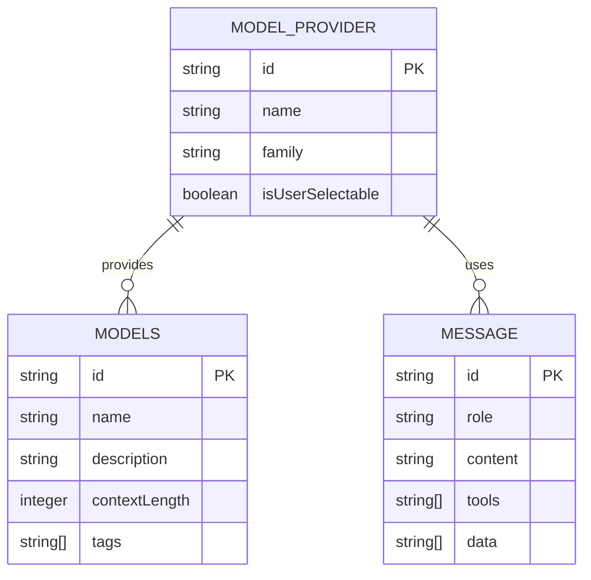
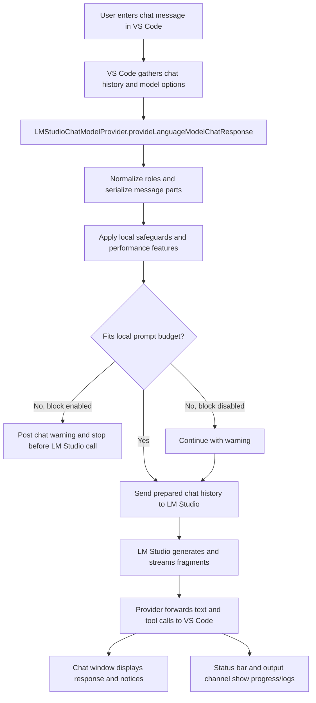
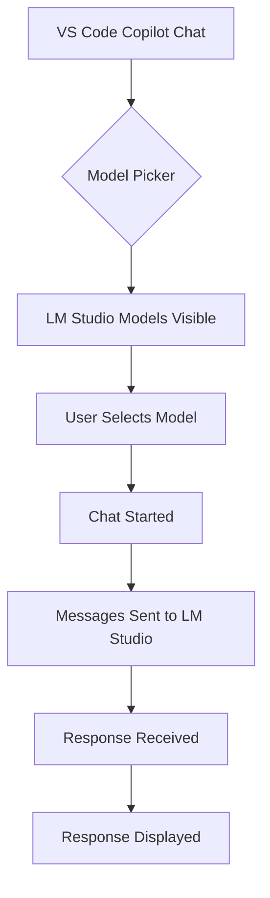
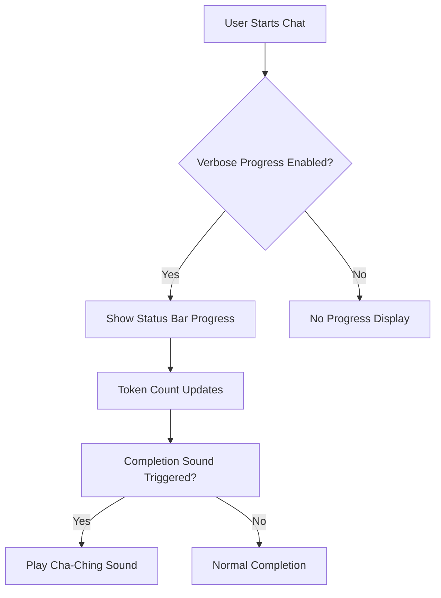

# Architecture Overview

## Table of Contents

1. Revision History
2. Executive Overview
3. Patterns and Technologies Used
4. Data Model Details
5. Authentication Details
6. Third-Party Services/APIs and How They Integrate
7. Chat Client Flow
8. Screen Flows
9. Important Application Entry Points
10. Getting Started for Developers
11. Key Business Rules
12. Key Architectural Takeaways
13. Glossary

## Revision History

| Version | Date       | Author        | Description                                                      |
| ------- | ---------- | ------------- | ---------------------------------------------------------------- |
| 1.0     | 2026-05-21 | Copilot Agent | Initial architecture documentation                               |
| 1.1     | 2026-05-22 | Copilot Agent | Added configuration and progress reporting details               |
| 1.2     | 2026-05-23 | Copilot Agent | Added context overflow handling and documentation updates        |

## Executive Overview

This document provides a comprehensive architectural overview of the LM Studio BYOK extension for VS Code. The extension enables VS Code users to access local language models through the Language Model Chat Provider API, allowing seamless integration with LM Studio's local LLM capabilities.

The extension implements the VS Code LanguageModelChatProvider interface to register LM Studio models with the Copilot Chat system. It handles the translation between VS Code's chat message format and LM Studio's expected input format, including proper role mapping, content serialization, and metadata handling.

Key features include:

- Model discovery and registration with VS Code's model picker
- Proper role preservation (system messages not downgraded to user)
- Complete message part serialization (text, data, tools)
- Automatic metadata refresh when context length changes
- User request prioritization for local models
- Verbose progress reporting in status bar and output channel
- Configurable token threshold sound notifications
- Performance optimization features

## Patterns and Technologies Used

- **Language**: TypeScript (ES2022 target)
- **Framework**: VS Code Extension Development API
- **SDK**: LM Studio SDK v1.4.0
- **Tokenization**: gpt-tokenizer
- **Build System**: Node.js with npm
- **API Version**: VS Code Language Model Chat Provider API 1.103+
- **Audio**: WAV file for sound notifications (Windows-specific)

## Data Model Details

## Authentication Details

The LM Studio BYOK extension does not require authentication as it connects to local LLMs. All communication happens locally within the user's machine, leveraging the LM Studio application's existing authentication and authorization mechanisms.

## Third-Party Services/APIs and How They Integrate

### VS Code Language Model Chat Provider API

The extension integrates with VS Code's Language Model Chat Provider API (version 1.103+), which provides:

- Model registration and discovery
- Message handling for chat conversations
- Context length and metadata management

### LM Studio SDK

The extension uses the LM Studio SDK v1.4.0 to:

- Communicate with local LLM instances
- Handle model metadata retrieval
- Process chat messages with proper formatting

### gpt-tokenizer

The extension leverages the gpt-tokenizer library for:

- Accurate token counting of text content
- Fallback token estimation when encoding fails

## Performance Optimization Features

The architecture now includes support for several performance optimization features that help manage context windows and improve efficiency when working with local LLMs:

- **Token Budgeting**: Estimates request token usage before send, shortens older history when needed, and posts a chat notice when context is shortened
- **Auto-Caveman Prompts**: Prepends a system instruction asking the model to be concise and preserve essentials
- **Context Overflow Policy**: Passes LM Studio overflow behavior through as `stopAtLimit`, `truncateMiddle`, or `rollingWindow`
- **Oversized Request Blocking**: Blocks requests locally when they still exceed the estimated prompt budget after trimming, unless the user disables that safety setting
- **Toggle All Performance**: Enables the currently implemented performance settings at once for testing and convenience
- **Cache Statistics**: Logs cache hit and miss rates when verbose logging is enabled

These features are designed to be toggleable with minimal overhead. `performanceOptimizations` is the master runtime gate, while the feature-specific settings control whether each implemented path is used.

## Chat Client Flow

The chat client flow starts in VS Code's chat UI, moves through the provider's request normalization and budget enforcement steps, then streams the model response back into the chat window. The provider is responsible for converting VS Code chat messages into LM Studio's chat format, applying local safeguards such as tool-result truncation and prompt budgeting, and then passing the prepared request to LM Studio.

At a high level, the flow is:

1. The user enters a message in the VS Code chat client.
2. VS Code sends the accumulated chat history and request options to the LM Studio chat provider.
3. The provider serializes message parts, preserves system messages, and prioritizes the explicit user request.
4. The provider applies local performance features such as caveman prompting, token budgeting, history trimming, and oversized-request blocking when enabled.
5. The provider sends the prepared request to LM Studio and streams response fragments back to VS Code.
6. VS Code renders text, tool calls, and status updates in the chat window and status bar.

## Screen Flows

### Authenticated User Flow

### Guest User Flow

### Progress Reporting Flow

## Important Application Entry Points

1. **extension.ts** - Extension activation and provider registration
2. **provider.ts** - LanguageModelChatProvider implementation
3. **package.json** - Extension manifest with model contributions and configuration

## Getting Started for Developers

### Environment Setup

1. Install Node.js (v18+ recommended)
2. Install VS Code
3. Clone the repository
4. Run `npm install` to install dependencies

### Debugging

1. Open the project in VS Code
2. Press F5 to start debugging
3. The extension will load in a new VS Code window
4. Use the built-in debugger to step through code

## Key Business Rules

1. Models must be registered with `isUserSelectable: true` to appear in the picker
2. Model family name must match the vendor name ("lmstudio")
3. System role messages (VS Code role=3) must be preserved as system messages
4. All message parts (text, data, tools) must be properly serialized
5. Context length metadata should automatically refresh when model context changes
6. Verbose progress reporting requires explicit user configuration
7. Sound notifications are only triggered when token threshold is exceeded
8. Oversized requests may be blocked locally before the LM Studio call when the estimated prompt budget still cannot be satisfied

## Key Architectural Takeaways

1. The extension acts as a bridge between VS Code's chat interface and LM Studio's local LLMs
2. Proper role mapping is crucial for correct model behavior
3. Content serialization must handle all message part types to prevent data loss
4. Metadata caching can cause issues if not properly refreshed when models change
5. The extension follows VS Code's Language Model Chat Provider API pattern
6. Progress reporting and sound notifications are optional features that enhance user experience
7. Audio notifications are Windows-specific implementation
8. Context control is split between provider-side trimming and LM Studio's backend overflow policy

## Configuration Details

### VS Code Settings

- `lmstudio.baseUrl`: Base URL for LM Studio server (default: "ws://localhost:1234")
- `lmstudio.apiKey`: API key for authentication (optional for local instances)
- `lmstudio.verboseLogging`: Enable verbose diagnostic logging to the 'LM Studio' output channel for troubleshooting (default: false)
- `lmstudio.verboseProgressReporting`: Show detailed LM Studio prompt/generation progress in the status bar and output channel (default: false)
- `lmstudio.playTokenThresholdSound`: Play a short cash-register style completion sound when a request exceeds the configured token threshold (default: false)
- `lmstudio.tokenSoundThreshold`: Approximate total token count required before the completion sound plays (default: 10000)
- `lmstudio.autoCavemanPrompts`: Prepends a system instruction asking the model to be concise while preserving essentials (default: false)
- `lmstudio.performanceOptimizations`: Master gate for implemented performance features (default: true)
- `lmstudio.tokenBudgeting`: Estimates prompt size, trims older history when needed, and warns about context pressure (default: false)
- `lmstudio.contextOverflowPolicy`: Chooses LM Studio's fallback overflow behavior after provider-side trimming (default: `truncateMiddle`)
- `lmstudio.blockOversizedRequests`: Blocks still-oversized requests locally unless disabled by the user (default: true)
- `lmstudio.toggleAllPerformance`: Enables the currently implemented performance features at once (default: false)

### Environment Variables

- `LMSTUDIO_API_KEY`: API key for LM Studio authentication
- `LMSTUDIO_BASE_URL`: Base URL for LM Studio server

## Glossary

- **BYOK**: Bring Your Own Key - referring to the ability to use local LLMs
- **LM Studio**: A desktop application for running and managing local language models
- **VS Code**: Microsoft's code editor
- **API**: Application Programming Interface
- **SDK**: Software Development Kit
- **Context Length**: The maximum number of tokens a model can process in a single conversation
- **Token**: A unit of text used by language models for processing
- **Cha-Ching Sound**: A short cash-register style audio notification sound
